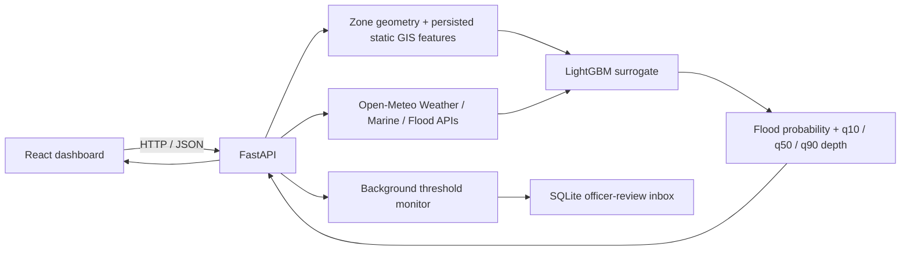

# CoastGuard-AI

### Coastal flood intelligence, zone-level risk estimation, and emergency-response decision support

CoastGuard-AI is a research and demonstration platform for exploring coastal flood risk around **Mangaluru** and **Udupi, Karnataka, India**. It combines a React/TypeScript GIS dashboard, a FastAPI service, a LightGBM surrogate model, selected live environmental feeds, persisted terrain features, and scenario tools for operational review.

> **Important — decision support, not an official warning system.** Model outputs are estimates, not observations or confirmed flood forecasts. The supplied surrogate was evaluated against physics-simulator labels for Mangaluru, not observed flood events. Udupi results are an unvalidated regional transfer. Do not use this application as the sole basis for evacuation, road closure, or public-warning decisions. Verify conditions with responsible authorities and field sources.

## At a glance

| | |
|---|---|
| **Study areas** | Mangaluru (7 configured zones) and Udupi (5 configured zones) |
| **Frontend** | React 19, TypeScript, Vite, Tailwind CSS, React-Leaflet |
| **Backend** | Python, FastAPI, Pydantic, NetworkX |
| **Surrogate** | Supplied LightGBM classifier and q10/q50/q90 depth regressors |
| **Dynamic environmental sources** | Open-Meteo Weather, Marine, and Flood APIs |
| **Persisted GIS inputs** | Copernicus DEM GLO-30, ESA WorldCover 2021, HydroRIVERS v10 |
| **API documentation** | FastAPI Swagger UI at `/docs` |

## What the application includes

- **Operations overview:** environmental conditions, zone risk, forecast timeline, priority list, infrastructure summaries, and officer inbox.
- **Interactive flood-risk map:** zone polygons, risk estimates, reference GIS layers, road/facility overlays, routes, and a zone-level depth proxy.
- **Zone analysis:** overview, road impact, facility access, explanation, what-if analysis, responder brief, and public-alert preview.
- **Emergency response views:** routes, shelters, facilities, alerts, and situation reports.
- **What-if scenarios:** adjust tide, rainfall, and surge inputs and compare baseline and simulated surrogate outputs.
- **Background risk monitoring:** the API process periodically evaluates configured zones and records officer-review events in a local SQLite inbox.

The map’s road, river, facility, and route geometry is reference data, not a live operational GIS feed. Road access is estimated from modelled zone depth; the project does not currently verify individual road conditions from field sensors.

## Architecture



### Prediction inputs and outputs

For each zone, the backend combines static terrain attributes with current basin-level inputs:

- **Static features:** HAND proxies, elevation, slope, curve number, impervious ratio, and distance-to-river/coast features.
- **Dynamic model features:** 1h, 3h, 6h, and 24h rainfall totals; antecedent rainfall; tide; estimated surge; and a rainfall–tide interaction.
- **Model outputs:** flood-label probability and q10, q50 (median), and q90 estimated inundation depths.

The external feeds are requested at representative coordinates for each study area. They are **nearest-grid API estimates**, not direct IMD, INCOIS, or CWC station feeds. River discharge is fetched for the environment display but is not part of the supplied surrogate’s 17-feature input set. Dynamic provider data is held in an in-memory cache for up to three minutes; it is not written to the static GIS database.

The what-if view uses the live environment as its baseline in normal operation. Its rainfall control applies an absolute change in mm/h, so a scenario can add rainfall when the current observed-grid estimate is zero. When the officer demo is active, the what-if view instead uses the explicitly synthetic demo baseline.

## Data, model, and limitations

### Surrogate model

The backend loads the root-level [`surrogate_model.pkl`](./surrogate_model.pkl). It contains a binary flood classifier and three quantile regressors. The backend sorts depth quantiles so `q10 ≤ q50 ≤ q90`.

The evaluation notebook is [`surrogate_model_evaluation.ipynb`](./surrogate_model_evaluation.ipynb). Its reported fidelity measures compare the surrogate with held-out physics-simulator results. They do **not** establish real-world forecast accuracy. The model was trained/evaluated for Mangaluru; Udupi predictions use the same model as an **unvalidated transfer**.

### GIS data

The static feature store is [`backend/app/data/static_gis.sqlite`](./backend/app/data/static_gis.sqlite). Source downloads are in [`backend/data/static_gis_sources/`](./backend/data/static_gis_sources/) and include Copernicus DEM GLO-30, ESA WorldCover 2021, and HydroRIVERS v10.

Important caveats:

- Study-area polygons and exposure counts are provisional project data, not authoritative administrative boundaries or independently verified inventories.
- Static features are aggregated over those polygons. Their generation does not reproduce the evaluation notebook’s missing H3 resolution-8 feature pipeline.
- HAND and coast-distance fields are documented approximations; curve-number inputs use a land-cover lookup and near-uniform HSG-D assumption.
- The marine API’s sea-level value is used as the tide feature without a configured chart-datum conversion. Datum calibration is needed before interpreting it operationally.
- Static feature values and GIS geometry do not update just because the weather feed refreshes.

See [backend/README.md](./backend/README.md) for additional source and feature notes.

### Monitoring and alerts

While the backend process is running, a background task checks Mangaluru and Udupi on a configurable interval (default **180 seconds**, minimum 60). It records a duty-officer review event when a zone crosses the configured probability or q50-depth threshold. The inbox is stored locally in SQLite.

By default, an event is visible in the application inbox; it does **not** wake an unattended operator. Optional email delivery requires SMTP configuration. The demo alert uses synthetic inputs and is marked as a demo. **SACHET / Cell Broadcast System (CBS) integration and public broadcast delivery are not implemented.**

This is an application-level monitor, not a managed 24/7 service: continuous monitoring requires the backend to run reliably on an always-on host with appropriate supervision, network access, storage, and notification configuration.

## Quick start

### Prerequisites

- Python **3.10 or newer**
- Node.js **20.19+ or 22.12+**, plus npm (Vite 8 requirement)
- Network access to the configured Open-Meteo APIs for live environmental data

### 1. Get the code and install Python dependencies

```powershell
git clone https://github.com/1SoulHunter1/Coastal_Flood_Intelligence.git
cd Coastal_Flood_Intelligence
python -m venv .venv
.\.venv\Scripts\Activate.ps1
python -m pip install --upgrade pip
python -m pip install -r requirements.txt
```

On macOS or Linux, activate the virtual environment with:

```bash
source .venv/bin/activate
```

Some geospatial Python dependencies may require compatible native libraries or platform-specific installation steps.

### 2. Start the backend

From the repository root:

```powershell
cd backend
python -m uvicorn app.main:app --reload --host 127.0.0.1 --port 8000
```

Check that the API is responding:

- Health: <http://127.0.0.1:8000/api/v1/health>
- Interactive API docs: <http://127.0.0.1:8000/docs>

### 3. Configure and start the frontend

In a second terminal, from the repository root:

```powershell
cd frontend
Copy-Item .env.example .env
npm install
npm run dev
```

Open the local URL printed by Vite (usually <http://localhost:5173>). The default API base URL in `frontend/.env.example` points to `http://127.0.0.1:8000/api/v1`.

For normal API-backed operation, leave `VITE_ENABLE_DEMO_FALLBACK=false`. Setting it to `true` explicitly permits local fixture fallback when API requests fail; those fixture values must not be mistaken for live data.

### Optional: rebuild the static GIS feature store

The repository includes the generated SQLite feature store and source-layer downloads. To regenerate the store, run from `backend/`:

```powershell
python -m scripts.build_static_gis
```

This is a one-time/static import workflow; it does not fetch live environmental conditions.

## Configuration

### Frontend

| Variable | Default | Purpose |
|---|---|---|
| `VITE_API_BASE_URL` | `http://127.0.0.1:8000/api/v1` | FastAPI base URL |
| `VITE_ENABLE_DEMO_FALLBACK` | `false` | Explicitly enable local fixture fallback |
| `VITE_MAPBOX_TOKEN` | unset | Optional Mapbox basemap token |
| `VITE_ESRI_API_KEY` | unset | Optional Esri basemap key |

Copy [`frontend/.env.example`](./frontend/.env.example) to `frontend/.env` to customize local development. Do not commit `.env` files or credentials.

### Backend

Backend settings are read from environment variables:

| Variable | Purpose |
|---|---|
| `COASTGUARD_MODEL_PATH` | Override the default root `surrogate_model.pkl` path |
| `COASTGUARD_MONITOR_INTERVAL_SECONDS` | Background scan period; default 180, minimum 60 |
| `COASTGUARD_MONITORING_OFFICER_NAME` | Display name for officer inbox messages |
| `COASTGUARD_SMTP_HOST` / `COASTGUARD_SMTP_PORT` | Optional SMTP server |
| `COASTGUARD_SMTP_FROM` / `COASTGUARD_OFFICER_EMAIL` | Sender and officer recipient addresses |
| `COASTGUARD_SMTP_USERNAME` / `COASTGUARD_SMTP_PASSWORD` | Optional SMTP authentication |

SMTP credentials should be supplied through the host’s secret/environment management, never committed to the repository.

## API overview

The primary API is mounted under `/api/v1`; interactive documentation is available at `/docs`.

| Area | Endpoint examples |
|---|---|
| Health and environment | `GET /api/v1/health`, `GET /api/v1/environment/current` |
| Zone predictions | `GET /api/v1/zones`, `GET /api/v1/zones/{zone_id}`, `GET /api/v1/zones/summary` |
| Forecast | `GET /api/v1/forecast/timeline` |
| Infrastructure | `GET /api/v1/infrastructure/summary`, `GET /api/v1/infrastructure/facilities`, `GET /api/v1/infrastructure/roads` |
| Routing and access | `GET /api/v1/routing/roads-impact`, `GET /api/v1/routing/hospitals-accessibility`, `GET /api/v1/routing/shelters-accessibility`, `GET /api/v1/routing/alternative-route` |
| What-if | `POST /api/v1/analysis/what-if` |
| Officer demo | `POST /api/v1/demo/trigger-officer-alert`, `POST /api/v1/demo/what-if`, `GET /api/v1/demo/officer-inbox` |
| Emergency and alerts | `GET /api/v1/emergency/priority-table`, `GET /api/v1/emergency/responder-briefing`, `GET /api/v1/alerts/active`, `GET /api/v1/alerts/public-template` |

For example, request live predictions for Mangaluru with:

```bash
curl "http://127.0.0.1:8000/api/v1/zones?study_area=mangaluru"
```

The API also exposes several routers without the `/api/v1` prefix for compatibility; use the prefixed endpoints for application integrations.

## Development and tests

### Frontend

Run from `frontend/`:

```bash
npm run build
npm run lint
```

### Backend

Run from `backend/`:

```powershell
python -m unittest discover -s tests -p "test_*.py"
```

The tests cover model input validation, static GIS feature loading, external-data parsing/failure behavior, what-if scenarios, modelled impact rules, officer inbox handling, and routing behavior.

## Repository layout

```text
.
├── backend/
│   ├── app/
│   │   ├── api/v1/          # FastAPI routes
│   │   ├── data/            # Zone, road, facility, and persisted static GIS data
│   │   ├── models/          # Pydantic schemas
│   │   └── services/        # Providers, surrogate, monitoring, routing, alerts
│   ├── data/static_gis_sources/
│   ├── scripts/             # Static GIS feature-store build
│   └── tests/
├── frontend/
│   └── src/
│       ├── components/
│       ├── context/
│       ├── data/             # Explicit demo/reference fixtures
│       ├── pages/
│       └── services/api.ts
├── surrogate_model.pkl
├── surrogate_model_evaluation.ipynb
├── train_model.py
└── requirements.txt
```

## Data attribution

The project uses or references data from:

- [Open-Meteo](https://open-meteo.com/) Weather, Marine, and Flood APIs
- [Copernicus DEM GLO-30](https://copernicus-dem-30m.s3.amazonaws.com/)
- [ESA WorldCover](https://esa-worldcover.org/)
- [HydroSHEDS / HydroRIVERS](https://www.hydrosheds.org/products/hydrorivers)
- [OpenStreetMap](https://www.openstreetmap.org/copyright) for map tiles and/or road-network data where used

Review each provider’s current terms, attribution requirements, and data-use conditions before deployment or redistribution.

## License

No project license is currently included. Unless a license is added, do not assume the repository’s code, model artifacts, or bundled datasets may be reused or redistributed.

## Contributing

Issues and pull requests are welcome. When reporting a prediction discrepancy, include the study area, zone, selected What-If inputs, API/demo mode, and the returned probability and depth quantiles. Do not include private credentials, officer contact information, or other sensitive operational data.
